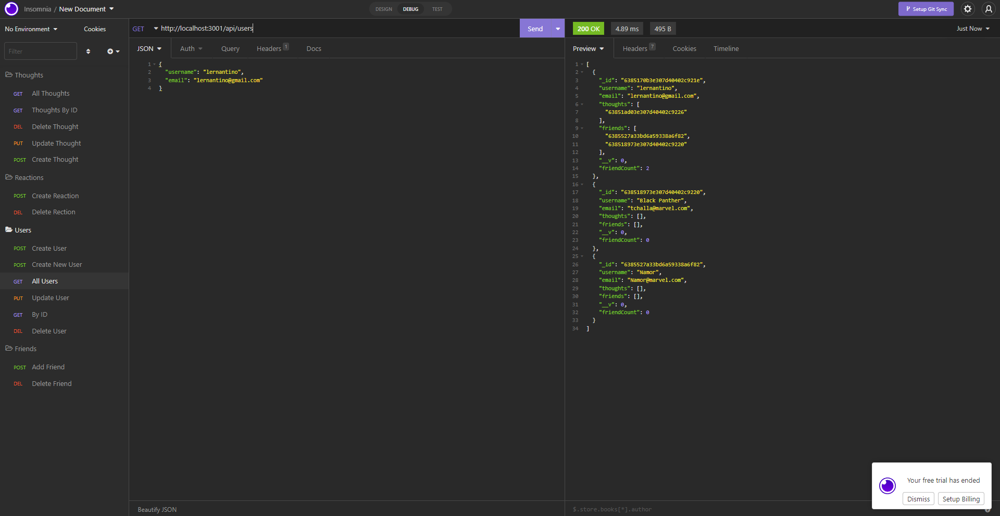

# social-media-api
  ## Badges
  
  
  ## Table of Contents
  * [License](#license)
  * [Built With](#built-with) 
  * [Description](#description)
  * [Installation](#installation)
  * [Usage](#usage)
  * [How to Contribute](#how-to-contribute)
  * [Tests](#tests)
  * [Questions?](#questions)
  
  ## License
  Read more about MIT here:
  [MIT](https://opensource.org/licenses/MIT)

  ## Built With
  * JavaScript
  * Node.js
  * Express.js
  * MongoDB
  * Mongoose
  * Insomnia
  
  ## Description
  This is an API for a social network web application where users can share their thoughts, react to friends' thoughts, and create a friend list. It uses Express.js for routing, a MongoDB database, the Mongoose ODM, and native JavaScript Date object to format timestamps. The seed data is created using Insomnia.  

  
  
  ## Installation
  Clone the project. Run "npm i" in your terminal to install necessary packages. 
  
  ## Usage
  A user can utilize this API to create a new user with a valid username and email, add other users as friends, post "thoughts" as well as "reactions" to thoughts, update and delete thoughts and reactions, and delete friends.

[Link to Demo](https://youtu.be/Wiw-hRUe99U)
  
  ## How to Contribute
  [Contributor Covenant](https://www.contributor-covenant.org/)  
  Not Applicable
  
  ## Tests
   Insomnia is used to test REST API calls. Please see the walk-through demonstration videos as well as the sections on Description and Usage to see how data is added and tested using Insomnia. 

  1. When the API GET routes for users and thoughts are opened in Insomnia, the data for each of the routes is displayed in formatted JSON.

  2. When the API POST, PUT, and DELETE routes are tested in Insomnia, the user can successfully create, update, and delete users and thoughts in the user's database.

  3. When the API POST and DELETE routes are tested in Insomnia, the user can successfully create and delete reactions to thoughts, and add and remove friends to a user's friend list.
  
  The following API routes are created to add and test data:

  ### API Routes 🔌 
On Insomnia, the following API routes have been created and used to add, update, or remove users, friends, thoughts, and reactions in the user's database. 

 **USER**
  * Create a new user:  `POST /api/users`
  * Get all users: `GET /api/users`
  * Get a single user by its `id`: `GET /api/users/:userId`
  * Update a user by its `id`: `PUT /api/users/:userId`
  * Delete a user by its `id`: `DEL /api/user/:userId`

 **FRIEND**
  * Add a new friend to a user's friend list: `POST /api/users/:userid/friends/:friendId`
  * Delete a friend from a user's friend list: `DEL /api/users/:userid/friends/:friendId`

**THOUGHT**
  * Create a new thought: `POST /api/thoughts/`
  * Get all thoughts: `GET /api/thoughts/`
  * Get a single thought by its `id`: `GET /api/thoughts/:thoughtId`
  * Update a thought by its `id`: `PUT /api/thoughts/:thoughtId`
  * Delete a thought by its `id`: `DEL /api/thoughts/:thoughtId`

 **REACTION**
  * Create a reaction: `POST /api/thoughts/:thoughtId/reactions`
  * Delete a reaction by the `reactionId`: `DEL /api/thoughts/:thoughtId/reactions/:reactionId`
  
  ## Questions?
  ### Reach me here: 
  [erbeard](https://github.com/erbeard)  
  sample@sample.com